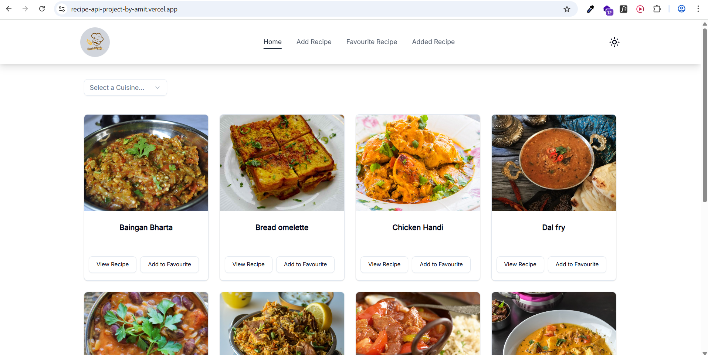
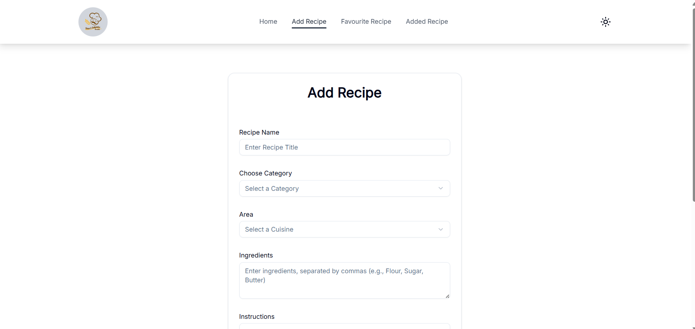
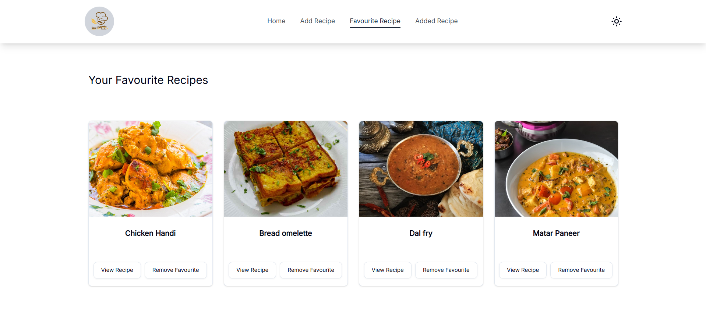
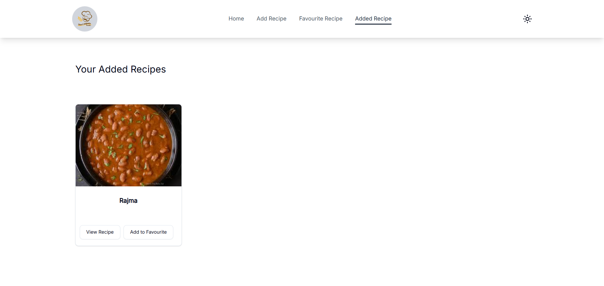

# React + Vite


Recipe API Project 🍽️

Welcome to the Recipe API Project, a dynamic and responsive web application built to help food enthusiasts explore, save, and share their favorite recipes! This project integrates TheMealDB API to provide a seamless recipe browsing experience, with features like recipe search, adding custom recipes, favoriting recipes, and a theme toggle for a personalized user experience. Deployed live at recipe-api-project-by-amit.vercel.app, this is my second major project, showcasing my skills in modern frontend development with React, Tailwind CSS, Framer Motion, shadcn, and Context API.

## 🚀 Features

- **Recipe Filter**: Filter recipes by cuisine using TheMealDB API, with real-time results displayed in a responsive grid.
- **Add Custom Recipes**: Users can add their own recipes with details like title, ingredients, instructions, and images, stored in local storage.
- **Favorite Recipes**: Save favorite recipes from TheMealDB API or custom recipes to a dedicated favorites section, persisted in local storage.
- **Recipe Details**: View detailed recipe information, including ingredients, instructions, and images, with a clean and intuitive UI.
- **Smooth Animations**: Page transitions and card hover effects powered by Framer Motion for a polished and engaging user experience.
- **Polished UI Components**: Beautiful and accessible UI components (buttons, forms, alerts) using shadcn for a modern look and feel.
- **Responsive Design**: Fully responsive layout that works seamlessly on desktops, tablets, and mobile devices, styled with Tailwind CSS.
- **Dark/Light Theme Toggle**: Switch between dark and light themes for a comfortable user experience, with theme persistence using local storage.
- **Interactive Navigation**: Smooth navigation with React Router, featuring a sticky header with menu toggle for mobile devices.
- **Context API for State Management**: Efficient global state management for recipes, favorites, and theme preferences using React Context.
- **Error Handling**: User-friendly error messages for failed API calls or invalid inputs, enhancing the user experience.
- **Google OAuth Authentication**: Secure user authentication with **Supabase** and Google Sign-In, featuring a popup flow with loading spinners for a smooth and user-friendly experience.
## 📸 Screenshots

### 🏠 Home Screen


---

### ➕ Add Recipe Screen


---

### ❤️ Favourite Screen


---

### ✅ Added Recipe Screen



🛠️ Tech Stack

Frontend: React.js, React Router
Styling: Tailwind CSS
UI Components: shadcn (for buttons, forms, alerts, etc.)
Animations: Framer Motion (for page transitions and card hover effects)
State Management: React Context API
API: TheMealDB API (https://www.themealdb.com/api.php)
Backend & Authentication**: Supabase (for storing custom recipes and user authentication)
Storage: Local Storage for persisting custom recipes, favorites, and theme preferences
Icons: React Icons
Deployment: Vercel
Version Control: Git, GitHub

📋 Prerequisites
To run this project locally, ensure you have the following installed:

Node.js (v16 or higher)
npm or Yarn
Git
A modern web browser (Chrome, Firefox, etc.)

🏁 Getting Started
Follow these steps to set up and run the project locally:

Clone the Repository:
git clone https://github.com/AmitFrontEnd/Recipe-Api-Project.git
cd Recipe-Api-Project


Install Dependencies:
npm install

or
yarn install


Run the Development Server:
npm start

or
yarn start

The app will be available at http://localhost:3000.

Explore the App:

Visit the home page to search for recipes using TheMealDB API.
Navigate to "Add Recipe" to create and save your own recipes.
Check the "Favourite Recipes" section to view saved recipes.
Toggle between dark and light themes using the theme button in the header.
Enjoy smooth page transitions and hover animations powered by Framer Motion.


## 📂 Project Structure

```plaintext
Recipe-Api-Project/
├── public/               # Static assets (e.g., logo)
├── src/                  # Source code
│   ├── assets/           # Images and other assets
│   │   ├── home.png
│   │   ├── addrecipe.png
│   │   ├── favourite.png
│   │   ├── added.png
│   ├── components/       # Reusable React components
│   ├── contexts/         # Context API files
│   ├── pages/            # Page components
│   ├── App.jsx           # Main App component
│   ├── index.jsx         # Entry point
│   ├── index.css         # Global styles
├── .gitignore            # Git ignore file
├── package.json          # Project dependencies and scripts
├── README.md             # Project documentation

```

🌟 Why This Project?
This project is a culmination of my passion for frontend development and love for food! 😋 Built as my second major project, it demonstrates my ability to:

Integrate third-party APIs (TheMealDB) for dynamic data fetching.
Create a responsive and user-friendly UI with Tailwind CSS and shadcn components.
Add smooth animations with Framer Motion for page transitions and hover effects.
Manage global state efficiently using React Context API.
Implement persistent storage with local storage for a seamless user experience.
Handle navigation and routing with React Router.
Deploy a production-ready app on Vercel.

It’s a perfect showcase for anyone looking to build a modern web application with React, and it’s open for contributions to make it even better!
🤝 Contributing
Contributions are welcome! If you have ideas for new features, bug fixes, or improvements, follow these steps:

Fork the repository.
Create a new branch: git checkout -b feature/your-feature-name.
Make your changes and commit: git commit -m 'Add your feature'.
Push to the branch: git push origin feature/your-feature-name.
Open a Pull Request.

Please read CONTRIBUTING.md for more details (create this file if not already present).
🐛 Issues
Found a bug? Have a feature request? Please open an issue on the GitHub Issues page.
🙌 Acknowledgments

TheMealDB for providing a free and awesome recipe API.
Tailwind CSS for making styling a breeze.
shadcn for beautiful and accessible UI components.
Framer Motion for smooth animations.
React Router for seamless navigation.
Vercel for easy deployment.
My mentors and peers for their support and feedback during development.

📬 Contact

## ✍️ Author

- **Name:** Amit Kumar  
- **GitHub:** [AmitFrontEnd](https://github.com/AmitFrontEnd)  
- **Email:** [amitemailu@gmail.com](mailto:amitemailu@gmail.com)  
- **Live Demo:** [recipe-api-project-by-amit.vercel.app](https://recipe-api-project-by-amit.vercel.app)  
- **LinkedIn:** [Amit Kumar](https://www.linkedin.com/in/amit-kumar-342681303)


⭐ If you like this project, give it a star on GitHub! ⭐Happy cooking and coding! 🍳💻
